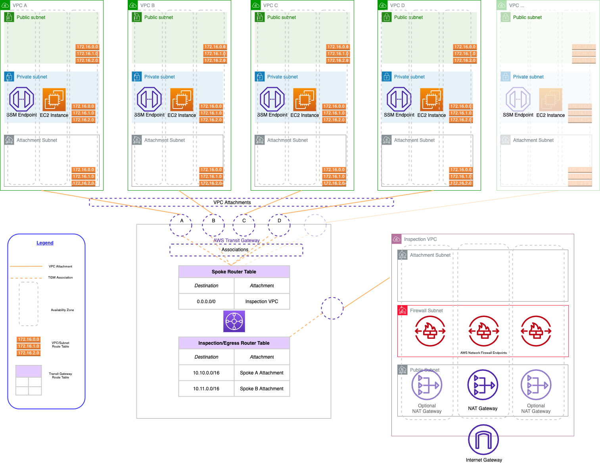

# Advanced Challenge: Centralized Egress

Create a Pulumi program that creates a network with centralized egress like the following architecture diagram:

The architecture you’ll be creating on AWS has three main infrastructure components: an inspection VPC, AWS Transit Gateway, and a series of spoke VPCs:

- The inspection VPC provides centralized egress. It is the only VPC that has a direct route to the internet via NAT Gateways, so all spoke VPCs in the architecture must route their traffic through the inspection VPC. A common pattern is to also put a firewall in the inspection VPC so that all egress traffic can be inspected at a single point.
- Network connectivity between VPCs is accomplished via AWS Transit Gateway. The Transit Gateway maintains a central routing table that is used to route traffic from the spoke VPCs to the internet. Note that you will also need to create routes so that return traffic from the internet can be routed back to the correct spoke VPC.
- The spoke VPCs are where we run our application workloads. They are isolated from each other and cannot communicate with each other unless we explicitly allow a network path. They will be able to communicate with the internet by default, but only through the inspection VPC’s NAT gateways.

One way of organizing the code (but not the only way):

- A ComponentResource representing the inspection VPC. (Called "inspection" because a Firewall in this network typically inspects all outbound traffic, allowing traffic to be inspected in a single place.)
- A ComponentResource representing the Spoke VPC that meets the following conditions:
  - All egress from any subnet in the Spoke VPC must flow through the centralized egress.
  - Note that ingress is still fine.
- A ComponentResource representing a simple workload to test network connectivity from the spoke VPC, e.g. an EC2 instance, container, or Lambda that queries `icanhazip.com` to verify that the IP address returned is one of the IP addresses of the NAT Gateways in the inspection VPC. If running a CLI command on EC2, AWS Systems Manager will likely be necessary for shell access unless you also want to create a VPN connection.

## Design Decision: AWSx VPC vs. Roll Your own

You can use the AWSx VPC component, or you can create your own VPC from simple resources. Each approach has its pros and cons:

If you use the AWSX VPC, you will need to create resources in an `apply()` because the number of availability zones is an input and therefore is not known until after after the VPC is provisioned. Creating resources in an `apply()` is not recommended practice because the resources may not show in preview. However, this is one of the few edge cases where there's no better alternative.

If you write your own VPC from simple resources (e.g. `aws.ec2.Subnet`, `aws.ec2.RoutingTable`, etc.), it's more code to write, but you get finer control and don't have to create resources in `apply()`. Overall, this is probably the more robust approach and what we would recommend in use cases that are intended to be long-lived production infrastructure.
