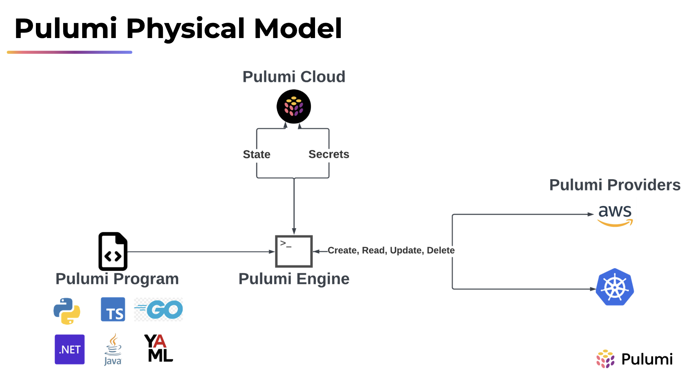

# **Module 01: Intro to Pulumi**

---


---


---


---

# The Pulumi Product Landscape

-   **Pulumi IaC:** Infrastructure as code, any language, any cloud, open source
-   **Pulumi PaC:** Author compliance and security controls in NodeJS or Python, works against any Pulumi program, open source
-   **Pulumi ESC (environments, secrets, config):** Compose environments of static config, static and dynamic secrets, pass to Pulumi programs or CLI commands
-   **Pulumi Cloud:** Pulumi's managed SaaS product

---


---

# Pulumi Programming Model, Key Terms

-   **Project:** A folder containing a Pulumi program (includes the file `Pulumi.yaml`)
-   **Program:** A collection of resources written in a supported language
-   **Stack:** An instance of a Pulumi program, typically with its configuration
-   **Provider:** Performs CRUD operations for a specific infrastructure backend (e.g., AWS, GitHub, Docker). Physically, it contains two things:
    1. A binary that does the work (typically written in Go)
    1. An SDK for a given language (which uses gRPC to communicate with the binary)

---



---

# Pulumi CLI: Key Commands

-   `pulumi new`: Bootstrap a Pulumi program
-   `pulumi preview`: Do a dry run of the Pulumi program and show the user what _would_ change
-   `pulumi up`: Run the Pulumi program and perform any necessary changes (includes `preview` by default)
-   `pulumi destroy`: Delete all resources in the state file
-   `pulumi refresh`: Refresh the state file to detect drift (not done by default for performance reasons)

Full list: <https://www.pulumi.com/docs/cli/>

---

# Resources Overview

Every resource takes the same 3 parameters:

1. **name:** Logical identifier for the resource in the Pulumi program. Must be unique per-type in a Pulumi program, e.g. no 2 VPCs named `andy`, but ok to name a VPC and Bucket both `andy`
1. **args:** Resource-specific inputs, e.g. Bucket name, website config, lifecycle
1. **options:** Common properties that control the resource lifecycle

Resources are immutable!

---

# Resources: Auto-naming

-   Auto-naming allows multiple stacks in the same environment (AWS account + region)
-   The Pulumi name will influence the physical name, e.g. `new aws.s3.BucketV2("my-bucket", ...` -> A bucket named `my-bucket-abc123`
-   Explicit naming also supported, e.g.:

Typescript:

```typescript
new aws.s3.BucketV2("my-bucket", {
    bucket: "the-exact-bucket-name",
});
```

Python:

```python
aws.s3.BucketV2("my-bucket",
    bucket="the-exact-bucket-name"
)
```

---

# Exercise: Build a Pulumi Program on AWS

See: `exercise-01-ecs-fargate.md`

---

# Inputs, Outputs, and Apply

-   **Inputs:** Values that may or may not be known and _may_ be supplied by the user, e.g., `aws.ec2.Instance.ami` is type `Input<string>`
-   **Outputs:** Values that may or may not be known, and cannot be entered by the user, e.g., `aws.ec2.Instance.arn` is type `Output<string>`
-   **Apply:** Method to get the raw value of an Input or Output (once it's known)
-   Inputs and Outputs may be complex types, e.g., `aws.s3.BucketV2.BucketWebsites` (static site config)
-   All inputs are also available outputs!
-   Inputs and Outputs work like promises in JS. `apply()` is like `.then()`

---

# Inputs, Outputs, and Apply, cont'd

-   Inputs and Outputs are what allow Pulumi to keep track of dependencies, so:
    1. You can write your infra in a declarative manner (desired state)
    1. Your infra spins up in the right order (create the VPC before the subnets)
    1. Your infra spins up with maximal parallelization (create all 3 subnets at once after the VPC)
-   **Do** Use `apply` when you need the known value, e.g., to create an IAM policy that consumes an ARN output (`Input<string>` to `string`)
-   **Don't** create resources in `apply` (if at all possible) because they won't show in `pulumi preview` unless values are already known
-   Helper functions exist for creating working with Inputs and Outputs in all languages, e.g., `pulumi.jsonStringify()`, `pulumi.interpolate()`

---

# Resource Options

TypeScript:

```typescript
const bucket = new aws.s3.BucketV2(
    "my-customer-data",
    {},
    {
        protect: true,
    },
);
```

Python:

```python
bucket = aws.s3.BucketV2("my-customer-data", (opts = ResourceOptions((protect = True))));
```

---

# Resource Options - Greatest Hits:

-   `alias`: Assign additional Pulumi name(s) to resources to enable refactoring
-   `deleteBeforeReplace`: Override the default behavior and delete a resource before replacing it (useful when names must be unique)
-   `dependsOn`: Set an explicit dependency where no implicit one exists
-   `ignoreChanges`: Allow specific resource properties to drift, e.g., subnet tags that are changed by EKS
-   `protect`: Prevent a resource from being deleted, e.g., prod DB

Full list: <https://www.pulumi.com/docs/concepts/options/>

---

# Stack Configuration

-   Each stack has its own config file `Pulumi.{STACK_NAME}.yaml`, e.g.`Pulumi.dev.yaml` or `Pulumi.prod.yaml`
-   Setting config values:

    ```bash
    $ pulumi config set my-key my-value
    $ cat Pulumi.dev.yaml
    config:
      project-name:my-key: my-value
    ```

---

# Stack Configuration - Reading

-   Reading config values:

TypeScript:

```typescript
const config = new pulumi.Config();
const optionalValue = config.get("some-optional-value") || "default-value";
const requiredValue = config.require("some-required-value");
// also, getBoolean(), getRequiredInt(), etc.
```

Python:

```python
config = pulumi.Config()
optionalValue = config.get("some-optional-value") or "default-value"
requiredValue = config.require("some-required-value")
# also, get_bool(), require_int(), etc.
```

---

# Secrets

-   Secrets may be stored in state files or stack configuration
-   **Secret Backends** Handle encryption and decryption of secrets
    -   Pulumi Cloud is default backend, other DIY options available, e.g., KMS
-   Secret values in resources are encrypted automatically in the Pulumi state file, e.g., RDS master password
    -   Leaking your state file will not leak secrets!
-   Stack config values can be marked as secret via `pulumi config set --secret`
    -   Stack config files can be safely committed to version control!

---

# Secrets in Stack Configuration

-   Config values can be marked as secret:

    ```bash
    $ pulumi config set my-secret my-secret-value --secret
    $ cat Pulumi.dev.yaml
    config:
      project-name:my-secret:
        secure: AAABABe3dkwePSpTak7vqjttYwEgE81sJJxpY7g2FSvZbn5sRMqZJ35372k2Lwg=
    ```

-   Read from the config file, e.g., `config.getSecret("key-name")`
-   More info: <https://www.pulumi.com/learn/building-with-pulumi/secrets/>

---

# Default and Explicit Providers

-   **Default providers:** Do not need to be declared. These will use the stack config (or, e.g., AWS credential chain, if not specified)
-   **Explicit providers:** Declared as Pulumi resources and must be assigned in resource options

    Use for multi-region deployments or, e.g., creating a K8s cluster and deploying resources onto it in the same program

---

# Default and Explicit Providers, cont'd

TypeScript:

```typescript
const bucket = new aws.s3.BucketV2("n-virginia-bucket"); // Assuming client is set up for us-east-1

const awsProvider = new aws.Provider("explicit-provider", {
    region: "us-east-2",
});
const bucketOhio = new aws.s3.BucketV2(
    "ohio-bucket",
    {},
    {
        provider: awsProvider,
    },
);
```

Python:

```python
bucket = aws.s3.BucketV2("n-virginia-bucket") # Assuming client is set up for us-east-1

awsProvider = aws.Provider("explicit-provider",
    region="us-east-2"
)
bucketOhio = aws.s3.BucketV2("ohio-bucket",
    opts=ResourceOptions(provider=awsProvider)
)
```

