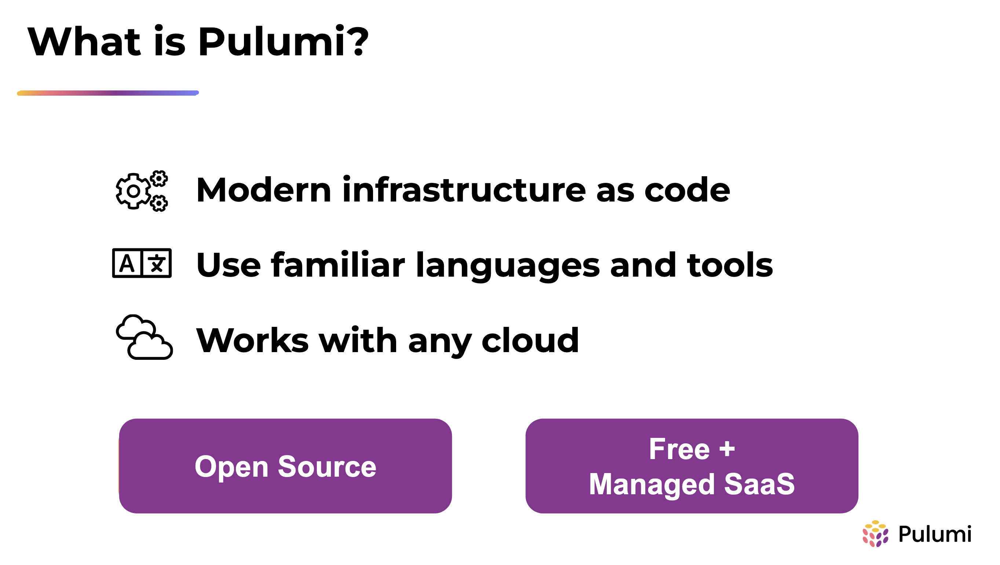
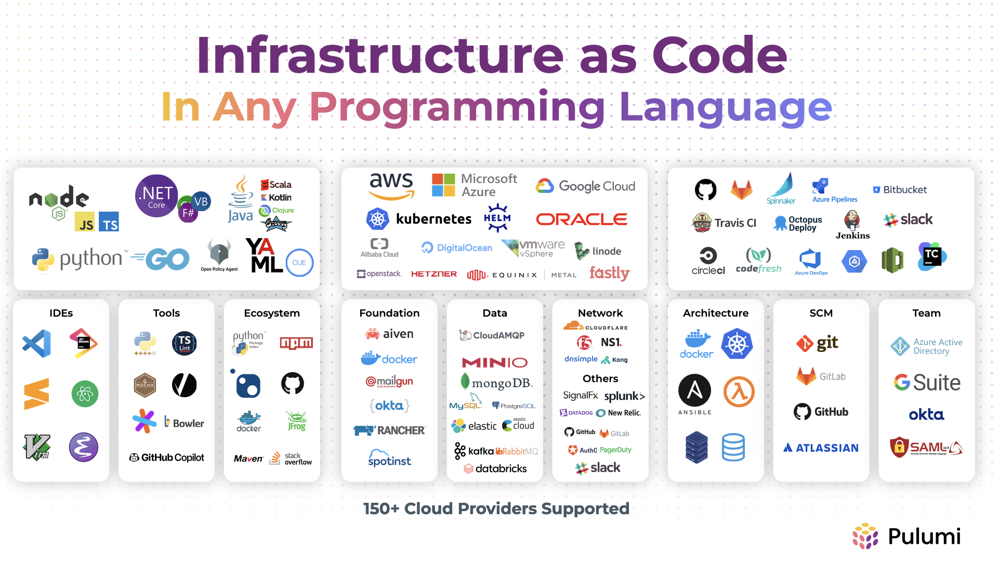
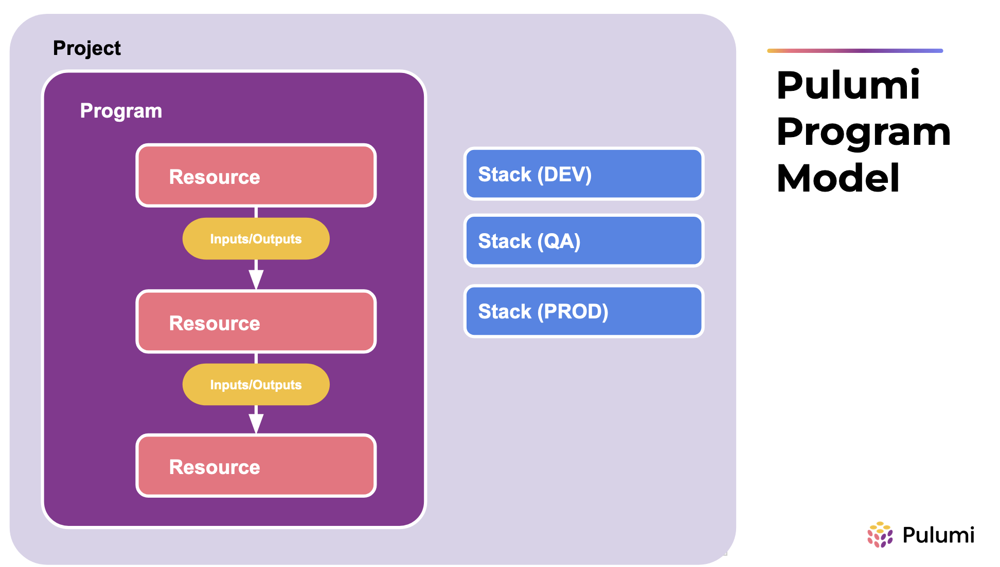

# **Module 01: Intro to Pulumi**

---



---



---


---

# The Pulumi Product Landscape

* **Pulumi IaC:** Infrastructure as code, any language, any cloud, open source
* **Pulumi PaC:** Author compliance and security controls in NodeJS or Python, works against any Pulumi program, open source
* **Pulumi ESC (environments, secrets, config):** Compose environments of static config, static and dynamic secrets, pass to Pulumi programs or CLI commands
* **Pulumi Cloud:** Pulumi's revenue-generating SaaS product

---



---

# Pulumi Programming Model, Key Terms

* **Project:** A folder containing a Pulumi program (contains the file `Pulumi.yaml`)
* **Program:** A collection of resources, written in a supported language
* **Stack:** An instance of a Pulumi program, typically with its own configuration
* **Provider:** Performs CRUD operations for a specific infrastructure backend (e.g. AWS, GitHub, Docker). Physically, contains 2 things:
  1. A binary that does the work (written in Go, FYI)
  1. An SDK for a given language (which uses gRPC to communicate with the binary)

---


---

# Pulumi CLI: Key Commands

* `pulumi new`: Bootstrap a Pulumi program
* `pulumi preview`: Do a dry run of the Pulumi program, show the user what _would_ change
* `pulumi up`: Run the Pulumi program, perform any necessary changes (includes `preview` by default)
* `pulumi destroy`: Delete all resources in the state file
* `pulumi refresh`: Refresh the state file (not done by default for performance reasons)

---

# Inputs, Outputs, and Apply

* **Inputs:** Values that may or may not be known, e.g. `aws.ec2.Instance.ami` is type `Input<string>`
* **Outputs:** Values that may or may not be known, cannot be entered by the user, e.g. `aws.ec2.Instance.arn` is type `Output<string>`
* **Apply:** Method to get the raw value of an Input or Output (once it's known)
* Inputs and Outputs may be complex types, e.g. `aws.s3.Bucket.BucketWebsite` (static site config)
* All inputs are also available outputs!
* Inputs and Outputs work like promises in JS. `apply()` is like `.then()`

---

# Inputs, Outputs, and Apply, cont'd

* Inputs, Outputs, and Apply are the design tradeoff for being able to use general purpose languages, keeping Pulumi declarative, and not synthing to an intermediate format, a la CDK.
* Do not create resources in an `Apply` (if you can avoid it, but in relatively rare cases you can't) because they will not show in `pulumi preview` unless values are already known!
* Helper functions exist for working with Inputs and Outputs in all languages, plus e.g. `pulumi.jsonStringify()`

---

# Stack Configuration

* Each stack has its own config file `Pulumi.{STACK_NAME}.yaml`, e.g.`Pulumi.dev.yaml`, `Pulumi.prod.yaml`
* Setting config values:

    ```bash
    $ pulumi config set my-key my-value
    $ cat Pulumi.dev.yaml
    config:
      project-name:my-key: my-value
    ```

* Reading config values:

    ```typescript
    const config = new pulumi.Config();
    const optionalValue = config.get("some-optional-value") || "default-value";
    const requiredValue = config.require("some-required-value");
    // also, getBoolean(), getRequiredInt(), etc.
    ```

---

# Secrets

* **Secret Backends:** Handle encryption and decryption of secrets (no storage). Pulumi Cloud by default, other DIY options available, e.g. KMS
* Secret values in resources are encrypted automatically in the Pulumi state file, e.g. RDS master password.
* Config values can be marked as secret:

    ```bash
    $ pulumi config set my-secret my-secret-value --secret
    $ cat Pulumi.dev.yaml
    config:
      project-name:my-secret:
        secure: AAABABe3dkwePSpTak7vqjttYwEgE81sJJxpY7g2FSvZbn5sRMqZJ35372k2Lwg=
    ```

* Read from config file via e.g. `Config.getSecret("key-name")`
* More info: <https://www.pulumi.com/learn/building-with-pulumi/secrets/>

---

# Resource Options

* Common to all Pulumi resources (3rd parameter, after name and resource properties), e.g.:

    ```typescript
    const bucket = new aws.s3.Bucket("my-customer-data", {}, {
        protect: true
    })
    ```

* Common use cases:
  * `dependsOn`: Set an explicit dependency where no implicit one exists, i.e. there's no (output on Resource A) -> (input on Resource B)
  * `protect`: Prevent a resource from being deleted, e.g. prod DB
  * `provider`: Set an explicit provider for a resource, e.g. multi-region or multi-account in AWS

More info: <https://www.pulumi.com/docs/concepts/options/>

---

# Default and Explicit Providers

* **Default providers:** Do not need to be declared. Will use config from stack config (or e.g. AWS credential chain if not specified).
* **Explicit providers:** Declared as Pulumi resources and must be assigned to resources:

    ```typescript
    const awsProvider = new aws.Provider("explicit-provider", {
        region: "us-east-2" // Because it's better than us-east-1. And y'all know it.
    })

    const bucket = new aws.s3.Bucket("ohio-bucket", {}, {
        provider: awsProvider
    })
    ```

  Use for multi-region deployments or e.g. creating a K8s cluster and deploying resources on to it in the same program.
