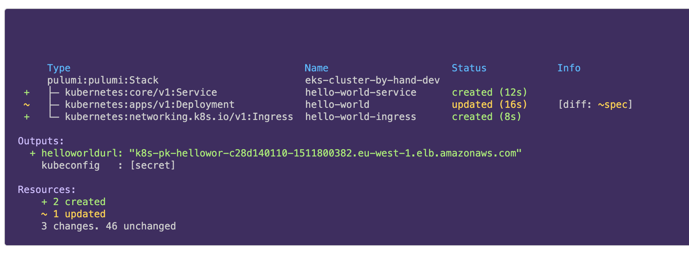
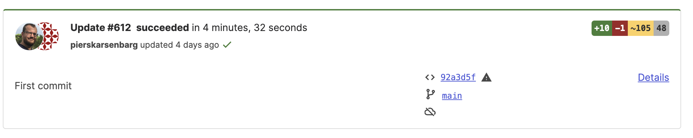

# **Module 02: Pulumi Cloud**

---

## Before we start

<!-- going to show a bitly or similar link to an org I'll set up which will have a few things deployed for the exercises -->

---

## What is Pulumi Cloud?

* State management
* Managing Access
* Collaboration
* Search
* Configuration
* Deployments
* Guardrails

---

## State management

---

### What is state?

* Source of truth for what is deployed using Pulumi
* Contains all inputs and outputs of all resources in stack
* Secrets encrypted
* Allows Pulumi to be declarative

---

### Self-managed

* Local filesystem
* AWS S3
* Azure Blob Storage
* Google Cloud Storage

<!-- also services with S3 compatible APIs -->

### Managed by Pulumi

* Transactional checkpoints
* Managed access
* Full deployment history
* Concurrent state locking

---

### Easy to migrate state

* Export using the CLI
* Import using the CLI

---

### Demo

<!-- migrating between s3 and Pulumi Cloud -->

---

## Managing Access

---

### Users, Teams and Organisations

* Organisation is the collection of users
* A user can be a member of multiple organisations
* User is either admin or member of an organisation
* Organisations can be split up into teams

---

### Pulumi permissions

* Read can preview, decrypt secrets and view outputs
* Write can run updates and destroy
* Admin can delete stacks
* Admin in team != Admin in organisation

---

### Teams

* Members divided into teams
* Teams are given read/write/admin/no access to stacks and environments

---

### Access Tokens

* Personal, Team, Organisation and Admin tokens available
* Personal token has the same rights as the user who created it
* Team token has same access as the team
* Organisation token can also create and delete teams and membership of teams
* Admin is a super-powered token

---

## Collaboration

---

### Overview

---

### Changes

---

### Code Links

---

### Exercises

<!-- Exploring activity history -->

---

## Search

* Every resource that you've deployed with Pulumi
* Across every cloud service you use
* Granular search with properties

---

### Demo

<!-- resource search -->

---

### Exercises

<!-- Login to Pulumi cloud and try different searches including property search -->

---

## Configuration

---

### In the before times

* Configuration and secrets were stack-based
* Couldn't share between stacks
* (Stack references)

---

### **E**nvironments **S**ecrets and **C**onfiguration

---

### Environments

* YAML-based configuration files
* Import into other environments
* Import into stacks
* OIDC access
* Open Environments
* Run commands with Environments

---

### Secrets

* Create secrets directly in ESC
* Access secrets from third party providers

---

### Secret providers supported

* 1Password
* AWS Secrets Manager
* Azure Keyvault
* Google Cloud Secrets Manager
* Hashicorp Vault

---

### Configuration

* Configuration values shared across stacks
* Available as environment variables or via Pulumi config class

---

### Access Management

* Restrict access to environments via teams
* Read - can view plaintext values set in the environment
* Open - can read dynamic values, secrets and run functions
* Write - can update the environment

---

### Demo

---

### ESC CLI

* Standalone or available through the Pulumi CLI
* Use OIDC with third party CLIs

---

### Demo

---

### Exercise

<!-- using esc with AWS CLI -->

---

## Deployments

---

### Pulumi Deployments

* Fully managed platform for managing your infrastructure
* Runs Pulumi programs at scale
* Lifecycle management
* Self-managed agents

---

### Triggering deployments

* REST API
* Git push
* Review stacks
* Click to deploy
* Scheduled deployments
* Automation API

---

### Lifecycle management

* Drift detection
* TTL on stacks

---

### Demo

---

## Crossguard

---

### Policy As Code

* Rules to enforce company best pracitices across infrastructure updates
* Written in Python or Typescript
* Can be run from the command line
* Published to Pulumi Cloud
* Enforced on updates
* Mandatory or advisory

---

### Use cases

* Security
* Cost compliance
* Reliability

---

### Pre-built compliance packages

* Open source
* Built alongside guidelines from frameworks such as PCI and the AWS Well Architected Framework
* Mix and match

---

### Integration with Pulumi Cloud

* Publish the policy packs as part of your CI/CD workflow
* Add your stacks to Policy Groups
* Policy packs are run during updates and previews

---

### Demo

---

### Exercises

<!-- Running policy as code on the command line -->