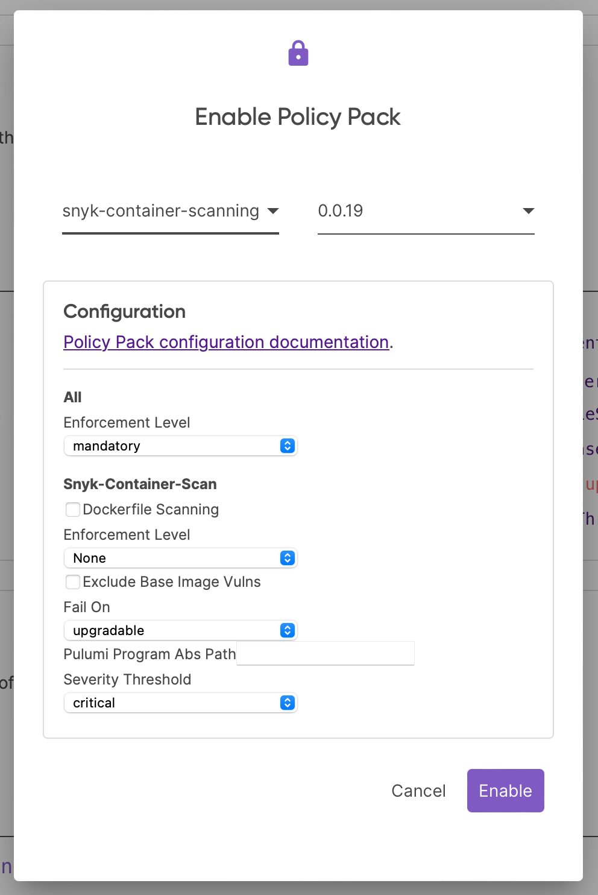

# **Module 05: Policy as Code**

---

# Policy Control Types

- **Preventative controls:**
  - Run before a resource is provisioned.
  - Examples: Pulumi Policy as Code, AWS Service Control Policies
  - Advantage: Faster feedback.
  - Disadvantage: Doesn't catch resources created out-of-band (e.g., Console)
- **Detective controls:**
  - Run after a resource is provisioned.
  - Examples: AWS Config, Pulumi stack policies (on `update`, not `preview`)
  - Advantage: Catches everything., even console updates
  - Disadvantage: Slower feedback, cloud-specific (necessarily).
- Either may include remediation actions

---

# Pulumi Policy as Code (AKA CrossGuard)

- Open source
- Author in Node.js or Python
- Works against Pulumi programs in any language (b/c gRPC)
- Run locally: `pulumi up --policy-pack path/to/policy-pack`
- Easily incorporate into pipelines
- _Much_ nicer and more capable authoring experience relative to DSL-type tools
- Output captured in CLI (and therefore Pulumi Cloud)
- User guide: <https://www.pulumi.com/docs/using-pulumi/crossguard/core-concepts/>

**Note:** OPA support is experimental

---

# Enforcement Levels

- `Disabled`: Do not run.
- `Advisory`: Validate, print warning and always return zero.
- `Mandatory`: Validate, print error, and return non-zero on failure.
- `Remediate`: Transform the resource to try fix the issue, validate, print error and return non-zero on failure.
- Can set a global default, or level per-policy

---

# Writing Resource Policy Rules: Fields

Each resource policy has the following fields:

- `name`, `description`: (self-explanatory, required)
- `enforcementLevel`: Default enforcement level (optional)
- `remediateResource`: Function to fix a potential validation issue. Executes only if `enforcementLevel` is set to `remediate`. Executes _before_ `validateResource` (optional).
- `validateResource`: Function to determine whether the resource complies. (required)
  - Multiple functions can be defined to group similar resources, e.g., ALB and ELB log configuration.

---

# Resource Validation Functions

- `validateResourceOfType()` helper function in TS.
- Must check type in Python, e.g.:

    ```python
    if args.resource_type != "aws:s3/bucket:Bucket":
        return
    ```

- Call `reportViolation` if validation fails.

```typescript
{
    name: "aws-s3-bucket-enable-server-side-encryption",
    description: "Check that S3 Bucket Server-Side Encryption (SSE) is enabled.",
    enforcementLevel: "advisory",
    validateResource: validateResourceOfType(Bucket, (bucket, args, reportViolation) => {
        if (!bucket.serverSideEncryptionConfiguration) {
            reportViolation("S3 Buckets Server-Side Encryption (SSE) should be enabled.");
        }
    }),
}
```

---

# Remediation Functions

- If the enforcement level is `remediate`, `remediateResource` runs before `validateResource`.
- Must `return` the resource after transforming.

```typescript
remediateResource: remediateResourceOfType(aws.s3.Bucket, (bucket, args) => {
    if (!bucket.tags || !bucket.tags["Department"]) {
        bucket.tags = bucket.tags || {};
        bucket.tags["Department"] = bucket.tags["Department"] || "IT0001";
    }

    return bucket;
}),
```

---

# Why not both? (Remediation and Validation in one)

`validateRemediateResourceOfType` combines both `validateResource` and `remediateResource`:

```typescript
{
    enforcementLevel: "remediate",
    name: "s3-tags",
    description: "Ensure required tags are present on S3 buckets.",
    ...validateRemediateResourceOfType(aws.s3.Bucket, (bucket, args, reportViolation) => {
        if (!bucket.tags || !bucket.tags["Department"]) {
            reportViolation("S3 Bucket is missing required Department tag");
            bucket.tags = bucket.tags || {};
            bucket.tags["Department"] = bucket.tags["Department"] || "IT0001";
        }
        return bucket;
    }),
}
```

---

# Running Policies (OSS/Client Side)

- For OSS, policies must be present on disk.
- `pulumi preview --policy-pack /path/to/policy-pack`
- `pulumi up --policy-pack /path/to/policy-pack`
- Can run multiple packs at once:

    ```bash
    pulumi up --policy-pack /path/to/policy-pack-1  --policy-pack /path/to/policy-pack-2
    ```

---

# Exercise: Authoring Resource Policies

See: `exercise-01-authoring-resource-polices.md`

---

# Stack Policies

- `preview`: Runs at the end of the Pulumi program (still preventative - nothing has been provisioned), best use
- `update`: Runs after resources have been provisioned (detective control), all outputs will be available
- `validateStack` instead of `validateResource`
- Does not work with `remediate` (there is no `remediateStack`)
- Useful for policies that depend on multiple resources (e.g., every S3 bucket must have has a corresponding replication bucket)

---

# Stack Policies: Example

```typescript
{
    name: "dynamodb-autoscaling-required",
    description: "Requires a dynamoDB table to have an associated App Autoscaling policy.",
    enforcementLevel: "mandatory",
    validateStack: (args: StackValidationArgs, reportViolation: ReportViolation) => {
        const dynamodbTables = args.resources.map(r => r.asType(aws.dynamodb.Table)).filter(r => r);
        const appScalingPolicies = args.resources.map(r => r.asType(aws.appautoscaling.Policy)).filter(r => r);

        const policyResourceIDMap: Record<string, q.ResolvedResource<aws.appautoscaling.Policy>> = {};
        for (const policy of appScalingPolicies) {
            policyResourceIDMap[policy.resourceId] = policy;
        }

        for (const table of dynamodbTables) {
            if (policyResourceIDMap[table.id] === undefined) {
                reportViolation(`DynamoDB table ${table.id} missing app autoscaling policy.`);
            }
        }
    },
}
```

---

# Compliance-Ready Policies

- Encapsulate rules for compliance frameworks: ISO 27001, PCI-DSS, CIS
- Open-source
- Select only needed policies using selectors:
  - `vendor`: `aws`, `azure`, `gcp`
  - `services`: `ec2`, `s3`, `rds`, etc.
  - `topics`: `encryption`,`cost`, `backup`,`availability`
  - `frameworks`: `pcidss`, `iso27001`, etc.
  - `severity`: `medium`, `high`, `critical`, etc.
- `policyManager` contains settings to print a summary.

More info: <https://www.pulumi.com/docs/using-pulumi/crossguard/compliance-ready-policies/>

---

# Custom Configuration, Authoring

Policy authors can define a config schema for each policy:

```json
configSchema: {
    properties: {
        "excludeBaseImageVulns": {
            default: false,
            type: "boolean"
        },
        "pulumiProgramAbsPath": {
            type: "string"
        },
        "severityThreshold": {
            default: "critical",
            enum: ["low", "medium", "high", "critical"]
        },
    },
```

---

# Custom Configuration, Consuming (Open Source)

Consumers can author a JSON file with config values:

```json
{
  "snyk-container-scan": { // policy name
    "excludeBaseImageVulns": true,
    "pulumiProgramAbsPath": "/Users/jkodroff/src/jkodroff/demo-pulumi-policy-snyk/infra",
    "severityThreshold": "high"
  }
}
```

And pass via the CLI:

```bash
pulumi preview --policy-pack ../policy --policy-pack-config policy-config.json
```

---

# Server-Side Enforcement

- Paid feature (currently Business Critical only)
- Publish policy packs via `pulumi policy publish`
- **Policy Group:** (some # of versioned policy packs) (policy pack config) + (some # of stacks)
- Default Policy Group automatically includes all stacks.
- When running `pulumi preview` or `pulumi up`, Pulumi CLI downloads the applicable packs and runs them. (Don't need to specify `--policy-pack`.)

---

# Custom Configuration, Consuming (Server-Side Enforcement)

Consumers can configure policy packs via the Pulumi Cloud UI:



---

# Exercise: Server-Side Policy Enforcement

See: `exercise-03-server-side-enforcement.md`
