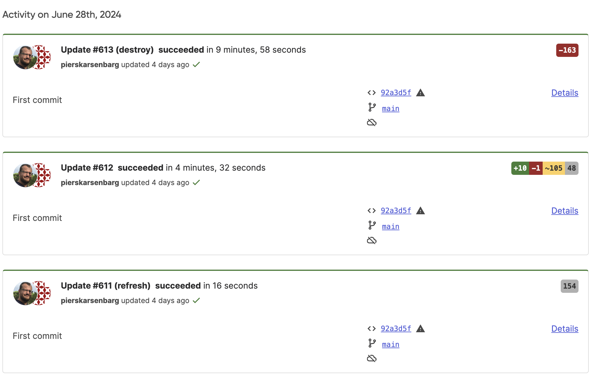
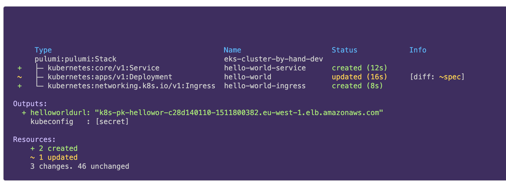
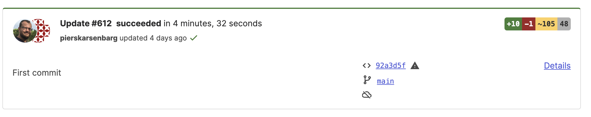

# **Module 06: Pulumi Cloud**

---

## Before we start

<!-- going to show a bitly or similar link to an org I'll set up which will have a few things deployed for the exercises -->

---

## Overview

* State management
* Managing Access
* Collaboration
* Search
* Configuration
* Deployments
* Guardrails

---

## State management

---

### What is state?

* Source of truth for what is deployed using Pulumi
* Contains all inputs and outputs of all resources in stack
* Secrets encrypted
* Allows Pulumi to be declarative

---

### Self-managed

* Local filesystem
* AWS S3
* Azure Blob Storage
* Google Cloud Storage
* Services with S3 compatible APIs

<!-- such as minio, ceph -->

### Managed by Pulumi

* Transactional checkpoints
* Managed access
* Full deployment history
* Concurrent state locking

---

### Pulumi Cloud provider

* Manage your Pulumi Cloud organisation with Pulumi

---

### Easy to migrate state

* Export using the CLI
* Import using the CLI

---

### Demo

<!-- migrating between backends and Pulumi Cloud -->

---

## Managing Access

---

### Users, Teams and Organisations

* Organisation is the collection of users
* A user can be a member of multiple organisations
* User is either admin or member of an organisation
* Organisations can be split up into teams

---

### Pulumi permissions

* Read can preview, decrypt secrets and view outputs
* Write can run updates and destroy
* Admin can delete stacks
* Admin in team != Admin in organisation

---

### Teams

* Members divided into teams
* Teams are given read/write/admin/no access to stacks and environments

---

### Access Tokens

* Personal, Team, Organisation and Admin tokens available
* Personal token has the same rights as the user who created it
* Team token has same access as the team
* Organisation token can also create and delete teams and membership of teams
* Admin is a super-powered token

---

## Collaboration

---

### Overview

---

### Changes

---

### Code Links

---

### Exercises

<!-- Exploring activity history -->

---

## Search

* Every resource that you've deployed with Pulumi
* Across every cloud service you use
* Granular search with properties

---

### Demo

<!-- resource search 

* type:"aws:ec2/securityGroup:SecurityGroup"
* type:"aws:ec2/instance:Instance" (because we don't manage them)
* "show me eks clusters in dev"

-->

---

### Copilot

* Prompt-driven infrastructure information
* Generate Pulumi programs
* Cost savings
* Deployment failures
* Read-only currently

---

### Exercises

<!-- Login to Pulumi cloud and try different searches including property search -->

---

## Configuration

---

### In the before times

* Configuration and secrets were stack-based
* Couldn't share between stacks
* (Stack references)

---

### **E**nvironments **S**ecrets and **C**onfiguration

---

### Environments

* YAML-based configuration files
* Import into other environments
* Import into stacks
* OIDC access
* Open Environments
* Run commands with Environments

---

## Deployments

---

### Pulumi Deployments

* Fully managed platform for managing your infrastructure
* Runs Pulumi programs at scale
* Lifecycle management
* Self-managed agents

---

### Triggering deployments

* REST API
* Git push
* Review stacks
* Click to deploy
* Scheduled deployments
* Automation API

---

### Lifecycle management

* Drift detection
* TTL on stacks

---

### Demo

---

## Pricing

---

### Resources Under Management

* Everything is a resource
* All resources cost the same

---

### Plans

* Individual
* Team
* Enterprise
* Business Critical

---

### What you're actually paying for

* State management
* Managing Access
* Collaboration
* Search
* Configuration
* Deployments
* Guardrails
