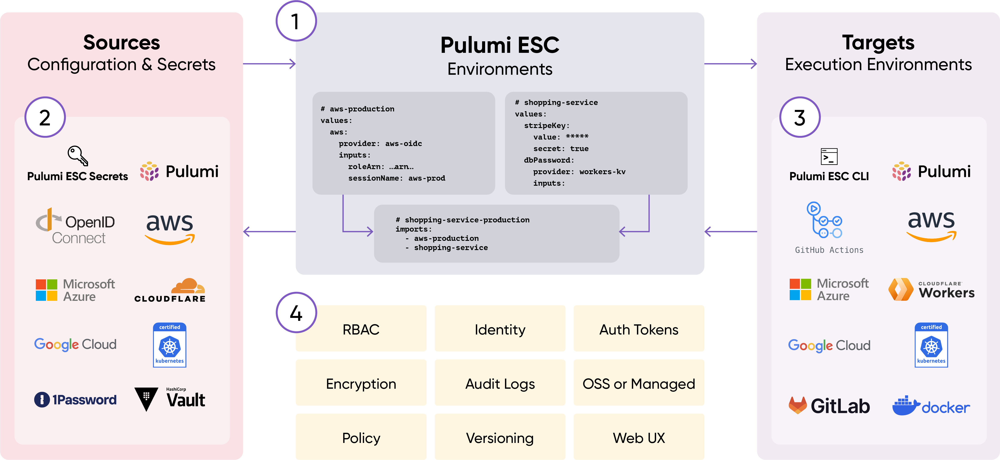

# **Module 07: Pulumi ESC**

---

# Problems with Cloud/IaC Adoption

- Secrets sprawl/static secrets: Risk of breach, rotation pain
- Config sprawl: Keep it DRY!
- Credentials sprawl: Keep it least priv!
- Auditing: Who accessed what, when, why?

---

# Pulumi ESC

Environments, secrets, and configuration

- Secrets orchestrator
- Integrates with many different secrets sources
- Multiple output targets
- Composable
- Versioning and auditing

---

# Pulumi ESC: Definitions

- **ESC**: Environments, Secrets, and Configuration
- **Environments**:
  - YAML doc
  - Configuration values: plaintext, stored in Pulumi Cloud
  - Comp secrets and configurations
- **Secrets**: Sensitive data such as API keys and passwords
  - **Static**: Values that do not change frequently but may be rotated
  - **Dynamic**: Fetched at execution time (environment open)
- **Configuration**: Non-secret values such as AWS regions

---

# Pulumi ESC: Sources

- Pulumi Cloud: secrets (encrypted) and config (plain text)
- OIDC x (AWS, Azure, Google Cloud)
- Managed secrets services x (AWS, Azure, Google Cloud, 1PW, Vault)
- Pulumi Stack outputs

---

# Pulumi ESC: Targets

- Environment variables: `TFVAR_foo`
- Files (`kubeconfig`)
- Pulumi Config

---

# Pulumi ESC: Controls

- RBAC
- Audit logs

---

# Pulumi ESC: Add'l Features

- Standalone CLI: `esc`
- Graphical key-value editor
- Projects
- Helper functions: JSON, Base64, etc. `fn::toBase64`
- Pulumi Cloud provider
- SDK
- Webhooks

---

## How it works



---

# Pulumi ESC Example: AWS OIDC

```yaml
aws:
  login:
    fn::open::aws-login:
      oidc:
        roleArn: arn:aws:iam::123456789:role/esc-oidc
        sessionName: pulumi-esc
  environmentVariables:
    AWS_ACCESS_KEY_ID: ${aws.login.accessKeyId}
    AWS_SECRET_ACCESS_KEY: ${aws.login.secretAccessKey}
    AWS_SESSION_TOKEN: ${aws.login.sessionToken}
```

---

# Pulumi ESC: Consuming Environment Variables

```bash
esc run my-project/aws-oidc-env -- aws s3 ls
# or
pulumi env run aws-oidc-env -- aws s3 ls
```

1. Pulumi Cloud token authenticates
1. Pulumi ESC RBAC authorizes
1. OIDC creds will be fetched and passed to the command as env vars

---

<style scoped>
  pre {
    font-size: 12pt;
  }
</style>

## Pulumi ESC: Importing other ESC Environments

Environment `my-project/aws-base`:

```yaml
aws:
  login:
    fn::open::aws-login:
      oidc:
        roleArn: arn:aws:iam::123456789:role/esc-oidc
        sessionName: pulumi-esc
  environmentVariables:
    AWS_ACCESS_KEY_ID: ${aws.login.accessKeyId}
    AWS_SECRET_ACCESS_KEY: ${aws.login.secretAccessKey}
    AWS_SESSION_TOKEN: ${aws.login.sessionToken}
    AWS_REGION: us-west-2
```

Environment `my-project/my-workload`:

```yaml
imports:
  - my-project/aws-base
values:
  foo: bar # Sample workload-specific-config
  environmentVariables:
    AWS_REGION: us-east-1 # <-- overrides base value

```

---

# Pulumi ESC: Pulumi IaC Integration

```bash
pulumi config env add default/aws-oidc-env --stack dev
```

Running the above command causes the Stack file to be updated as:

```yaml
environment:
  - default/aws-oidc-env
```

---

# Pulumi ESC: File Output Example

```yaml
# File Name: local-k8s-env
values:
  files:
    KUBECONFIG: |
      apiVersion: v1
      kind: Config
      clusters:
      - cluster:
          server: https://127.0.0.1:6443
        name: docker-desktop
```

```bash
esc run default/local-k8s-env -- kubectl get namespaces
```

---

# Features - RBAC

- `read`: Members can view only plaintext key values (Configs)
- `open`: Members can decrypt secrets + get dynamic credentials
- `write`: Members can `open` + update the Environment
- `admin`: Members can `write` + delete the Environment


---

# Features - Auditing


---

## Features - Versioning

- Versioning via `<project-name>/<environment-name>@<tag>` syntax
  - Built-in `latest` tag
  - Allows for reference pinning and rollbacks

```bash
# see tag history
esc env version history default/aws-oidc-env
# view a particular tag
esc env open default/aws-oidc-env@1
esc env open default/aws-oidc-env@latest
# find the diff in tags
esc env diff default/aws-oidc-env@1 default/aws-oidc-env@latest
# assign a new tag
esc env version tag default/aws-oidc-env@greatest @latest
```
