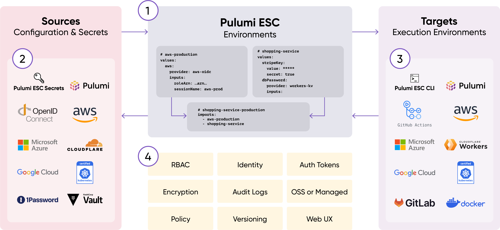
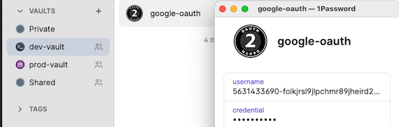
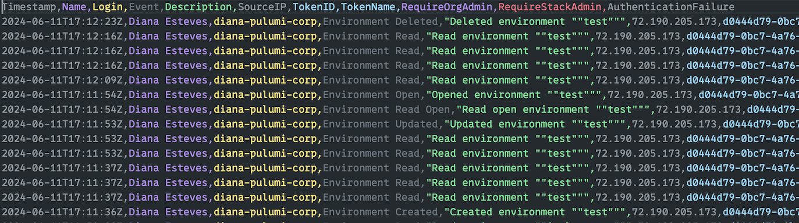
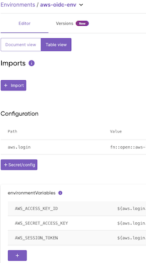

# 🌐 Overview

Pulumi ESC aims to:

- consolidate secrets and configuration management
- offer a uniform consumption interface
- allow for secrets to be managed with minimal to no disruption to _targets_
(byproduct, facilitate secret management solution migrations)

---

## Definitions

- **ESC**: Environments, Secrets, and Configuration
- **Environments**:
  - Configuration values: plaintext, stored in Pulumi Cloud
  - Comp secrets and configurations
- **Secrets**: Sensitive data such as API keys and passwords
  - **Static**: Values that do not change frequently but may be rotated
  - **Dynamic**: Fetched (or generated) on the fly and may have a short validity period
- **Configuration**: Non-secret values such as AWS regions

---

## How it works



---

## Sources & Targets

<!-- Naming may have to be updated. See https://github.com/pulumi/docs/issues/12015 -->
- **Pulumi ESC Sources (Providers)**: dynamically import secrets and configurations from various sources to your Environment. Includes:

  - AWS (via OpenID Connect and AWS Secrets Manager)
  - GCP, Azure, Vault, 1Password, and [more](https://www.pulumi.com/docs/esc/providers/)

- **Pulumi ESC Targets**: ESC Environments are consumed by cloud providers, applications, and development tools (Docker, Direnv, Kubernetes, Terraform, and [more](https://www.pulumi.com/docs/esc/other-integrations/)).

Examples of each follow.

---

## AWS OIDC Example

Per AWS, "we **strongly** recommend that you do **not** store AWS credentials long-term in applications outside AWS". The Pulumi ESC AWS OIDC Provider allows you to configure your applications to request temporary AWS security credentials _dynamically_ via OIDC federation.

AWS Resources needed:

- AWS IAM OIDC IdP
- AWS IAM Role (with a trust relationship to the OIDC IdP)
- AWS IAM Policies to attach to the Role

You can use a Pulumi program to create the above AWS Resources.

---

## AWS OIDC

```yaml
aws:
  login:
    fn::open::aws-login:
      oidc:
        roleArn: arn:aws:iam::123456789:role/esc-oidc
        sessionName: pulumi-environments-session
  environmentVariables:
    AWS_ACCESS_KEY_ID: ${aws.login.accessKeyId}
    AWS_SECRET_ACCESS_KEY: ${aws.login.secretAccessKey}
    AWS_SESSION_TOKEN: ${aws.login.sessionToken}
```

---

## AWS OIDC Example cont'd

Use:

```bash
esc env open aws-oidc -- aws s3 ls
```

For more configuration options, see the [Configuring OIDC](https://www.pulumi.com/docs/esc/providers/aws-login/#configuring-oidc) page.

---

## 1Password Example

Store secrets in 1Password and consume them via ESC for a Golang app to use as environment variables. 1Password resources needed:

- A Vault, `dev-vault`
- A Service Account with read access to the Vault, `dev-vault-read-service-account`
- A Vault item, `google-oauth` with two fields: `username` and `credential`

  

---

## 1Password Example cont'd

Create an Environment with the 1Password configuration:

```yaml
#File Name: op-env
values:
  1password:
    secrets:
      fn::open::1password-secrets:
        login:
          serviceAccountToken:
            fn::secret: # dev-vault-read-service-account's token
              ciphertext: ZXN...
        get:
          app_oauth_client_id:
            ref: "op://dev-vault/google-oauth/username"
          app_oauth_client_secret:
            ref: "op://dev-vault/google-oauth/credential"
  environmentVariables:
    CLIENT_ID: ${1password.secrets.app_oauth_client_id}
    CLIENT_SECRET: ${1password.secrets.app_oauth_client_secret}
```

---

## 1Password Example cont'd

Load the environment variables for a Golang app:

```bash
esc run op-env go run .
```

Code snippet referencing the environment variables:

```go
// File Name: main.go
var googleOauthConfig = &oauth2.Config{
  ClientID:     os.Getenv("CLIENT_ID"),
  ClientSecret: os.Getenv("CLIENT_SECRET"),
  Scopes:       []string{
    "https://www.googleapis.com/auth/userinfo.email", 
    "https://www.googleapis.com/auth/userinfo.profile"},
  Endpoint:     google.Endpoint,
}
```

---

## Target Options - Importing other ESC Environments

ESC Environments can be consumed in various ways known as targets. Below are the most popular targets along with the common use case.

- **Via other ESC Environments**: Defined in the `imports` section of the Environment file

  ```yaml
    # File Name: base-environment
    values:
      environmentVariables:
        AWS_DEFAULT_REGION: us-west-2
    ```

    ```yaml
    # File Name: dev-environment
    imports:
    - base-environment
    ```

---

## Target Options - CLIs

- **Environment Variables**:

  - Loaded via the ESC CLI or the Pulumi CLI

    ```bash
    esc run aws-oidc-env -- aws s3 ls
    pulumi env run aws-oidc-env -- aws s3 ls
    ```

  - Great for app development, scripting, and shell commands

    ```bash
    esc run aws-oidc-env -i -- bash
    ```

---

## Target Options - SDKs

- **Via SDKs**: You can read ESC Environments from within Pulumi programs either in the Stack file or via the SDK. This is a great way to consume config and secrets needed for CI/CD pipelines e.g., Pulumi GitHub Actions
  - Example of an ESC Environment referenced in a Pulumi Stack

    ```bash
    # Adds an Environment to a Pulumi Stack
    pulumi config env add aws-oidc-env --stack dev
    ```

    Running the above command causes the Stack file to be updated as:

    ```yaml
    # File Name: Pulumi.dev.yaml
    environment:
    - aws-oidc-env
    ```

---

## Target Options - SDKs cont'd

- Example of using the SDK to open an ESC Environment:

  ```typescript
  // File Name: index.ts
  import * as esc from "@pulumi/esc-sdk";
  async function main() {
    const config = new esc.Configuration({ 
      accessToken: process.env.PULUMI_ACCESS_TOKEN! 
    });
    const client = new esc.EscApi(config);
    const orgName = process.env.PULUMI_ORG!;
    const envName = "aws-oidc-env";
    const openEnv = await client.openAndReadEnvironment(
      orgName, 
      envName);
  }
  ```

---

## Docker Example

ESC can be used to create temporary, local files. This is particularly useful for running shell commands that take files as arguments or to obfuscate sensitive data from being logged in the terminal history.

Example ESC Environment, `docker-env-test`:

```yaml
values:
    environmentVariables:
        ESC_ORG: You are in the ${context.pulumi.organization.login} organization!
        ESC_HELLO_USER: Hello, ${context.pulumi.user.login}!
    files:
        DOCKER_ENVFILE: |
            ESC_ORG=${environmentVariables.ESC_ORG}
            ESC_HELLO_USER=${environmentVariables.ESC_HELLO_USER}
```

---

## Docker Example cont'd

Example with Docker commands:

```bash
$ esc open docker-env-test --format shell

export ESC_HELLO_USER="Hello, example-user!"
export ESC_ORG="You are in the example organization!"
export DOCKER_ENVFILE="/var/folders/ny/f_y5fsqd235fpx5bs6ghyk4w0000gn/T/esc-1312668514"

```

Reference the env-file to set environment variables dynamically in a `docker run` command:

```bash
esc run -i docker-env-test -- sh -c 'docker run --rm -t --env-file=$DOCKER_ENVFILE alpine env'
```

---

## Kubernetes Example

```yaml
# File Name: local-k8s-env
values:
  files:
    KUBECONFIG: |
      apiVersion: v1
      kind: Config
      clusters:
      - cluster:
          server: https://127.0.0.1:6443
        name: docker-desktop
```

This command opens the Environment you just created, renders the `kubeconfig` as a temporary file, sets the `KUBECONFIG` environment variable to refer to the file, and then runs a `kubectl` command.

```bash
esc run local-k8s-env -- kubectl get namespaces
```

---

## Management Options

You can manage (CRUD) Pulumi ESC Environments in several ways. Below are common use cases for each method:

- **Pulumi ESC CLI**:
  - Use ESC independently of Pulumi IaC, e.g., for application development
  - Combine with other shell commands
  - Scripting

- **Pulumi CLI (via the `pulumi esc` command)**:
  - If you already have Pulumi installed and/or use other Pulumi Cloud services
  - Scripting

---

## Management Options cont'd

- **SDKs**:
  - Align with GitOps practices
  - Pulumi Service Provider for managing all Pulumi Cloud resources
  - ESC Provider for managing ESC-related resources

- **Pulumi Cloud**:
  - Great for getting started / browsing / ad-hoc testing. Options:
    - **Console**
    - **REST API Endpoints**

---

## Features - RBAC

- `read`: Members can view only plaintext key values (Configs)
- `open`: Members can decrypt secrets + get dynamic credentials
- `write`: Members can `open` + update the Environment
- `admin`: Members can `write` + delete the Environment

  

---

## Features - Auditing

- CSV Exportable (Enterprise + Business Critical plans)
- Tracked fields:
`Timestamp,Name,Login,Event,Description,SourceIP,TokenID,TokenName,RequireOrgAdmin,RequireStackAdmin,AuthenticationFailure`
  Example
  

---

## Features - Versioning

- Versioning via `<environment-name>@<tag>` syntax
  - Built-in `latest` tag
  - Allows for reference pinning and rollbacks

    ```bash
    # see tag history
    esc env version history aws-oidc-env
    # view a particular tag
    esc env open aws-oidc-env@1
    esc env open aws-oidc-env@latest
    # find the diff in tags
    esc env diff aws-oidc-env@1 aws-oidc-env@latest
    # assign a new tag
    esc env version tag aws-oidc-env@greatest @latest
    ```

---

## Features - KV Table Editor

- User-friendly alternative

  

---

## GA & Pricing

- Currently in preview, expected to reach General Availability (GA) in September 2024
- Pricing TBD, free during the preview phase
